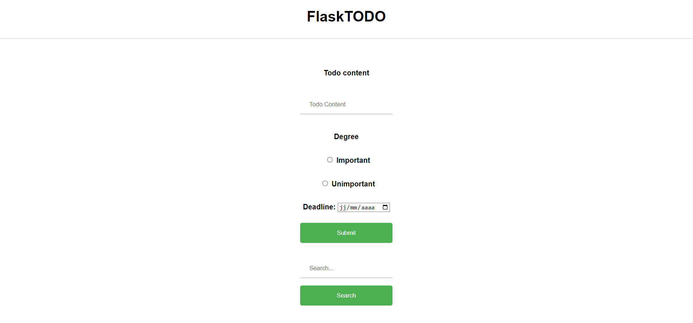
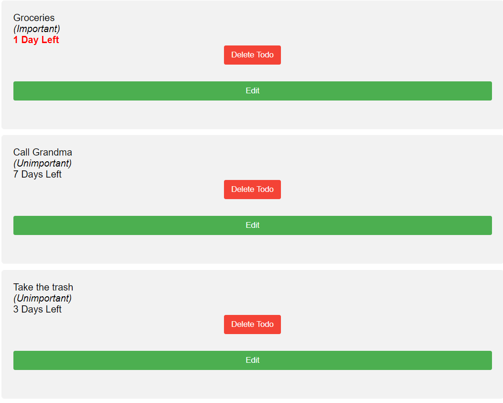

# CA4

#Todo Application
This is a simple Todo application built with Python and Flask. The application allows users to add tasks, mark tasks as complete, and sort tasks by importance and deadline.

#Usage
- Access the application at http://localhost:5000.
- Add a new task by filling out the form at the bottom of the page and clicking "Add Task".
- Search tasks by any regex expressions with the "Search" button.

- Delete a task when it is completed by pressing the "Delete" button next to the task.

